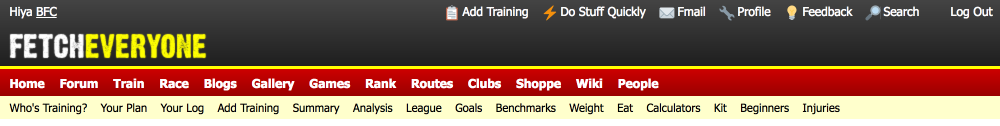

# Pretty FetchEveryone

This is a very basic (and my first) Chrome extension that gives [FetchEveryone.com](https://fetcheveryone.com) a modern coat of paint and irons out the niggles that annoy me.

Things it does so far:

- Makes the entire header background black with a nice gradient... see how pretty this looks:
  
- Replaces some of the icons with better looking versions borrowed from around the internet. I can definitely improve these too 😉.
- Makes the "Update Training Entry" and "Add New Training" pages a lot prettier by...
  - shifting the two columns to be ~50% of the width - the old proportions make no sense to me and feel horrible.
  - Adjusts the widths and appearance of some of the fields in the left column.
- Hides the "recently online" images in the footer - I don't need these pics and they only slow the page load times (marginally).
- Hides the "Member of the Month" nomination box.
- Hides the Amazon begging box and the annoying advert bar at the top of the page (assuming your adblocker doesn't block it already 😉)
